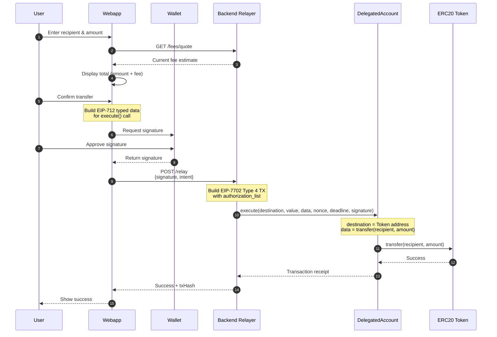
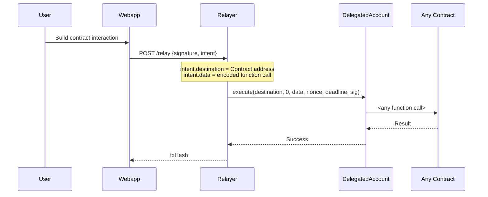
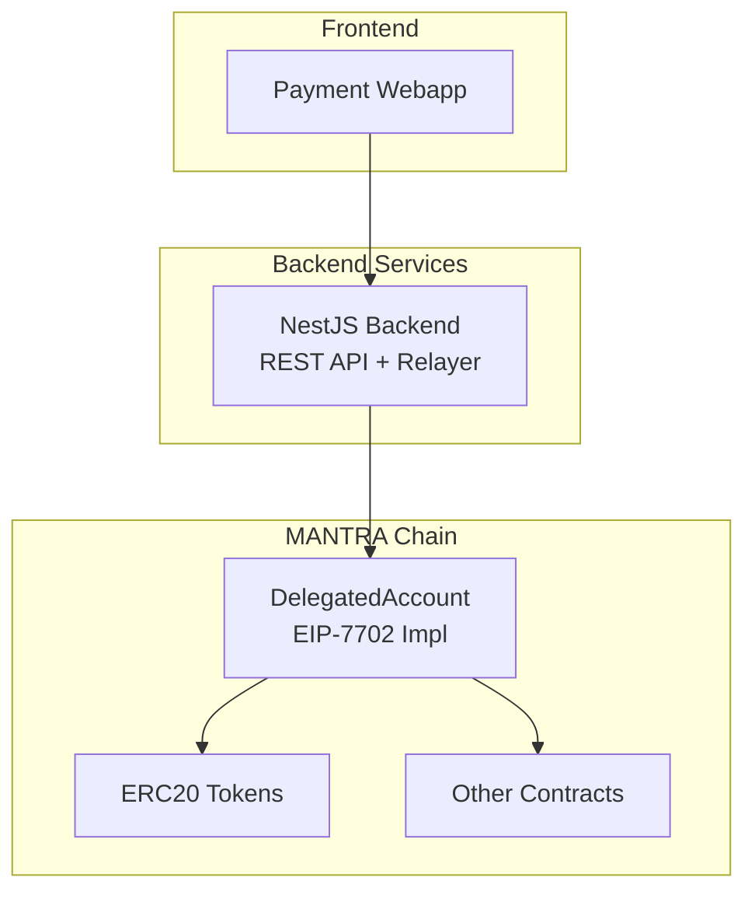
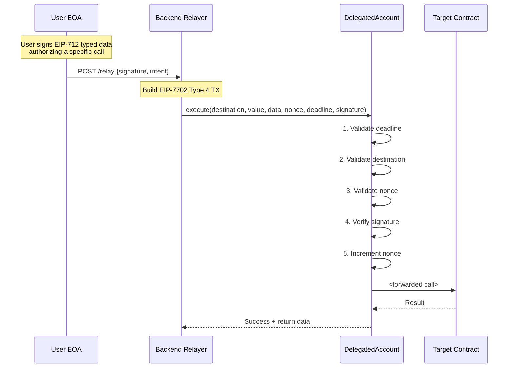
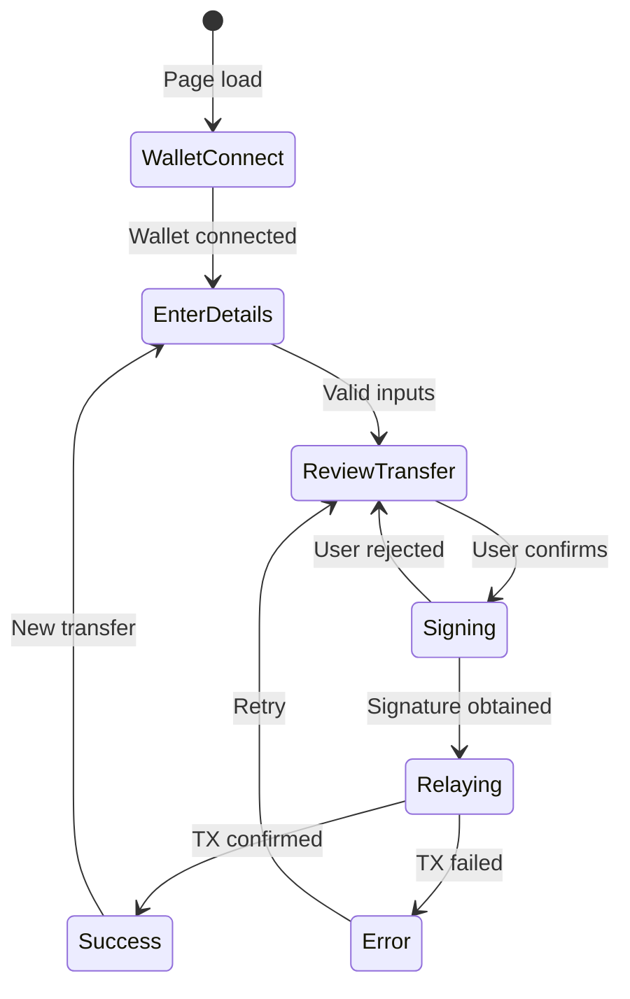

# EIP-7702 Gasless Transaction Relay for MANTRA Chain

## Version 3.0

---

## 1. Executive Overview

### 1.1 Project Context

This project builds upon the **OMies dApp SPA Template** - a production-ready React 19 + Foundry monorepo designed for
MANTRA Chain. The existing infrastructure provides:

- **Frontend**: React 19, Vite, TanStack Router, Wagmi + Viem, AppKit (WalletConnect)
- **Contracts**: Foundry-based Solidity development with MANTRA Chain configurations
- **Components**: Pre-built Web3 components (`TransactionDialog`, `WalletConnectPill`, `TokenInput`, etc.)

### 1.2 EIP-7702 Technical Context

EIP-7702 enables **temporary EOA delegation** via Type 4 transactions, allowing:

- EOAs to execute smart contract logic without permanent migration
- Atomic authorization + execution in a single transaction
- Relayer-sponsored gas (gasless UX for users)
- Revocable delegation controlled by the EOA owner

### 1.3 Project Scope

**mantraUSD-Pay** provides a **gasless transaction relay service** for MANTRA Chain. Users can:

1. **Transfer ERC20 tokens** without paying gas (relayer sponsors gas)
2. **Execute arbitrary contract calls** via EIP-7702 delegation

This is NOT a merchant/POS system. It's a general-purpose gasless relay that supports any ERC20 transfer or contract
interaction.

### 1.4 Supported Tokens

| Network                   | Contract Address                             | Symbol    | Decimals |
|---------------------------|----------------------------------------------|-----------|----------|
| **Mainnet (5888)**        | `0xd2b95283011E47257917770D28Bb3EE44c849f6F` | mantraUSD | 6        |
| **Dukong Testnet (5887)** | `0x4B545d0758eda6601B051259bD977125fbdA7ba2` | mmUSD     | 6        |

**Note:** The relay service can support any ERC20 token. The above are the primary tokens for the MANTRA ecosystem.

### 1.5 Fee Model

The platform uses a simple **gas-based fee** to cover relayer costs:

```
User Fee = (estimatedGas × gasPrice × (1 + bufferPercent)) converted to token
```

**Fee Parameters:**

| Parameter          | Value          | Description                             |
|--------------------|----------------|-----------------------------------------|
| **Estimated Gas**  | 150,000        | Conservative estimate for EIP-7702 tx   |
| **Buffer Percent** | 20%            | Covers gas price volatility             |
| **Max Fee**        | 1.00 mantraUSD | Hard cap to protect users               |
| **Min Fee**        | 0.01 mantraUSD | Minimum charge when fee is enabled      |
| **Fee Enabled**    | Configurable   | Can be disabled for promotional periods |

**Example:**

```
Gas Price:        0.001 OM
Estimated Gas:    150,000
Gas Cost:         0.15 OM
OM/USD Rate:      $0.25
Gas in USD:       $0.0375
With 20% Buffer:  $0.045
User Pays:        0.045 mantraUSD (rounded up to 0.05)
```

---

## 2. User Flow

### 2.1 Gasless ERC20 Transfer



### 2.2 Gasless Contract Call

The same flow works for any arbitrary contract call:



**Supported Use Cases:**

- ERC20 `transfer()` and `approve()`
- NFT transfers
- DEX swaps
- Staking/unstaking
- Any contract interaction the user authorizes

---

## 3. System Architecture

### 3.1 High-Level Architecture



### 3.2 Repository Structure

```
packages/
├── contracts/           # Foundry smart contracts
│   └── src/
│       └── DelegatedAccount.sol
├── webapp/              # React frontend
│   └── src/
│       ├── routes/
│       │   ├── index.tsx        # Transfer UI
│       │   └── execute.tsx      # Generic execute UI
│       └── hooks/
│           ├── useEIP712Sign.ts
│           └── useRelayTransaction.ts
├── backend/             # NestJS API + Relayer
│   └── src/
│       └── modules/
│           ├── relay/
│           ├── fee/
│           └── blockchain/
└── docs/
    └── mantraUSD-Pay-PRD.md
```

---

## 4. Smart Contract: DelegatedAccount.sol

The core EIP-7702 implementation contract that user EOAs delegate to for gasless transactions.

### 4.1 Design Principles

- **Stateless**: All state lives on the delegating EOA, not this contract
- **Generic**: Can execute ANY arbitrary contract call
- **Secure**: Nonce tracking, deadline enforcement, signature verification
- **Compatible**: Supports both EOA and smart contract wallets (EIP-1271)

### 4.2 How `execute()` Works

The `execute()` function is a **generic call forwarder**:



### 4.3 Interface

```solidity
interface IDelegatedAccount {
    // Events
    event Executed(
        address indexed executor,    // The user EOA (msg.sender in EIP-7702)
        address indexed destination, // Target contract
        uint256 value,               // ETH value sent
        uint256 nonce,               // Nonce used
        bool success                 // Whether call succeeded
    );

    event TokenTransferred(
        address indexed token,
        address indexed from,
        address indexed to,
        uint256 amount
    );

    // Errors
    error InvalidSignature();
    error SignatureExpired();
    error InvalidNonce();
    error InvalidDestination();
    error InvalidToken();
    error ExecutionFailed(bytes reason);
    error Reentrancy();

    // EIP-712 Constants
    bytes32 constant EXECUTE_TYPEHASH = keccak256(
        "ExecuteData(address destination,uint256 value,bytes data,uint256 nonce,uint256 deadline)"
    );

    function DOMAIN_SEPARATOR() external view returns (bytes32);

    /// @notice Execute an arbitrary call on behalf of the caller
    /// @param destination Target contract address
    /// @param value ETH value to send (usually 0 for token ops)
    /// @param data Encoded function call
    /// @param nonce Current nonce for replay protection
    /// @param deadline Timestamp after which signature is invalid
    /// @param signature EIP-712 signature from the caller
    /// @return Result bytes from the destination call
    function execute(
        address destination,
        uint256 value,
        bytes calldata data,
        uint256 nonce,
        uint256 deadline,
        bytes calldata signature
    ) external returns (bytes memory);

    /// @notice Convenience function for token transfers
    function transferToken(
        address token,
        address to,
        uint256 amount
    ) external;

    /// @notice Get current nonce for an account
    function getNonce(address account) external view returns (uint256);
}
```

### 4.4 EIP-712 Typed Data

Users sign this structure to authorize a call:

```typescript
// Domain
const domain = {
  name: 'DelegatedAccount',
  version: '1',
  chainId: 5888,
  verifyingContract: '0x...DelegatedAccount...'
};

// Types
const types = {
  ExecuteData: [
    {name: 'destination', type: 'address'},
    {name: 'value', type: 'uint256'},
    {name: 'data', type: 'bytes'},
    {name: 'nonce', type: 'uint256'},
    {name: 'deadline', type: 'uint256'},
  ],
};

// Example: ERC20 transfer
const message = {
  destination: '0x...TokenAddress...',
  value: 0n,
  data: encodeFunctionData({
    abi: erc20Abi,
    functionName: 'transfer',
    args: [recipientAddress, amount]
  }),
  nonce: 0n,
  deadline: BigInt(Math.floor(Date.now() / 1000) + 300), // 5 minutes
};
```

### 4.5 Security Considerations

| Check           | Purpose                                                   |
|-----------------|-----------------------------------------------------------|
| **Nonce**       | Prevents replay attacks; incremented after each execution |
| **Deadline**    | Limits signature validity (recommended: 5-15 minutes)     |
| **Signature**   | Proves user authorized this exact call                    |
| **Destination** | Cannot call address(0) or DelegatedAccount itself         |
| **Reentrancy**  | Guard prevents recursive calls                            |

---

## 5. Backend API Specifications

### 5.1 Overview

The NestJS backend serves as the transaction relayer.

**Responsibilities:**

- Fee quote calculation
- Transaction relay (gasless execution)
- Nonce management
- Rate limiting

### 5.2 Fee API

#### Get Fee Quote

```
GET /fees/quote?chainId={chainId}
```

**Response:**

```typescript
interface FeeQuote {
  fee: string;            // Fee in token units (e.g., "0.05")
  feeFormatted: string;   // Human readable (e.g., "0.05 mantraUSD")
  gasPrice: string;       // Current gas price in wei
  gasPriceGwei: string;   // Gas price in Gwei
  estimatedGas: number;   // Gas units (150000)
  bufferPercent: number;  // Buffer applied (20)
  expiresAt: number;      // Quote expiration timestamp
  enabled: boolean;       // Whether fees are enabled
}
```

### 5.3 Relay API

#### Relay Transaction

```
POST /relay
```

**Request Body:**

```typescript
interface RelayRequest {
  userAddress: string;
  signature: string;       // EIP-712 signature
  intent: {
    destination: string;   // Target contract address
    value: string;         // Native value (usually "0")
    data: string;          // Encoded function call
    nonce: string;         // User nonce
    deadline: string;      // Signature expiration
  };
  chainId: number;
}
```

**Response:**

```typescript
interface RelayResult {
  success: boolean;
  txHash: string;
  explorerUrl: string;
  message: string;
}
```

#### Get Relayer Status

```
GET /relay/status?chainId={chainId}
```

**Response:**

```typescript
interface RelayStatus {
  available: boolean;
  balance: string;      // Relayer native balance
  address: string;      // Relayer address
}
```

### 5.4 Nonce API

#### Get User Nonce

```
GET /nonce/{address}?chainId={chainId}
```

**Response:**

```typescript
{
  nonce: string;        // Current nonce as string
  nonceNumber: number;  // Current nonce as number
}
```

### 5.5 Security & Validation

| Validation                 | Description                           |
|----------------------------|---------------------------------------|
| **Signature Verification** | Recover signer matches userAddress    |
| **Nonce Check**            | Verify nonce matches on-chain nonce   |
| **Deadline Check**         | Reject expired signatures             |
| **Simulation**             | Simulate transaction before broadcast |
| **Rate Limiting**          | 10 requests per minute per IP         |
| **Gas Price Cap**          | Reject if gas price exceeds threshold |

---

## 6. Frontend Specifications

### 6.1 Route Structure

```
/                    # Home - Transfer UI
/execute             # Advanced - Generic contract call
```

### 6.2 Required Hooks

| Hook                         | Description                         |
|------------------------------|-------------------------------------|
| `useEIP712Sign()`            | Build typed data, request signature |
| `useRelayTransaction()`      | Submit signed intent to relay       |
| `useFeeQuote(chainId)`       | Fetch current fee quote             |
| `useNonce(address, chainId)` | Get user's current nonce            |

### 6.3 Transfer UI Components

| Component           | Purpose                          |
|---------------------|----------------------------------|
| `TokenSelector`     | Select token to transfer         |
| `RecipientInput`    | Enter recipient address          |
| `AmountInput`       | Enter amount with balance check  |
| `FeeDisplay`        | Show current relay fee           |
| `TransferButton`    | Initiate signature + relay       |
| `TransactionStatus` | Show pending/success/error state |

### 6.4 UI States



---

## 7. Security Considerations

### 7.1 Smart Contract Security

| Control                    | Description                                   |
|----------------------------|-----------------------------------------------|
| **Nonce Management**       | Strict nonce tracking prevents replay attacks |
| **Deadline Enforcement**   | All signatures have expiration timestamps     |
| **Destination Validation** | Cannot call self or zero address              |
| **Signature Verification** | EIP-712 prevents signature malleability       |
| **Reentrancy Guard**       | Prevents recursive call attacks               |

### 7.2 Relayer Security

| Control           | Description                                 |
|-------------------|---------------------------------------------|
| **Simulation**    | All transactions simulated before broadcast |
| **Rate Limiting** | Prevent DoS attacks                         |
| **Gas Budget**    | Monitor relayer balance                     |
| **Nonce Sync**    | Prevent front-running attacks               |

### 7.3 Frontend Security

| Control               | Description                                 |
|-----------------------|---------------------------------------------|
| **Domain Binding**    | EIP-712 domain includes contract + chain ID |
| **User Confirmation** | Clear UI showing what user is signing       |
| **No Private Keys**   | All signing via wallet connection           |

---

## 8. Supported Networks

| Network        | Chain ID | Environment | RPC                               |
|----------------|----------|-------------|-----------------------------------|
| MANTRA Mainnet | 5888     | Production  | https://rpc.mantrachain.io        |
| MANTRA Dukong  | 5887     | Testnet     | https://rpc.dukong.mantrachain.io |

---

## 9. Future Enhancements

| Enhancement         | Priority | Description                         |
|---------------------|----------|-------------------------------------|
| Multi-token fees    | Medium   | Accept fees in different tokens     |
| Batch transactions  | Medium   | Execute multiple calls in one TX    |
| Permit support      | High     | Gasless approvals via EIP-2612      |
| Transaction history | Low      | Store and display past transactions |
| Webhook callbacks   | Medium   | Notify apps of transaction status   |

---

This PRD defines a simple, focused gasless transaction relay service for MANTRA Chain using EIP-7702.
