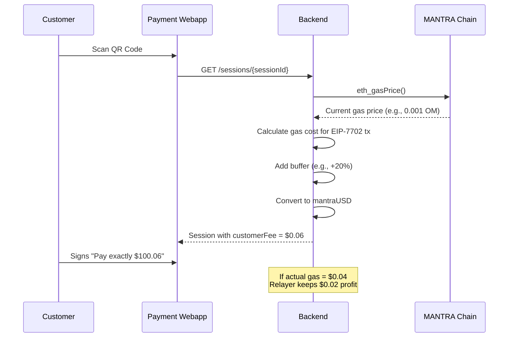
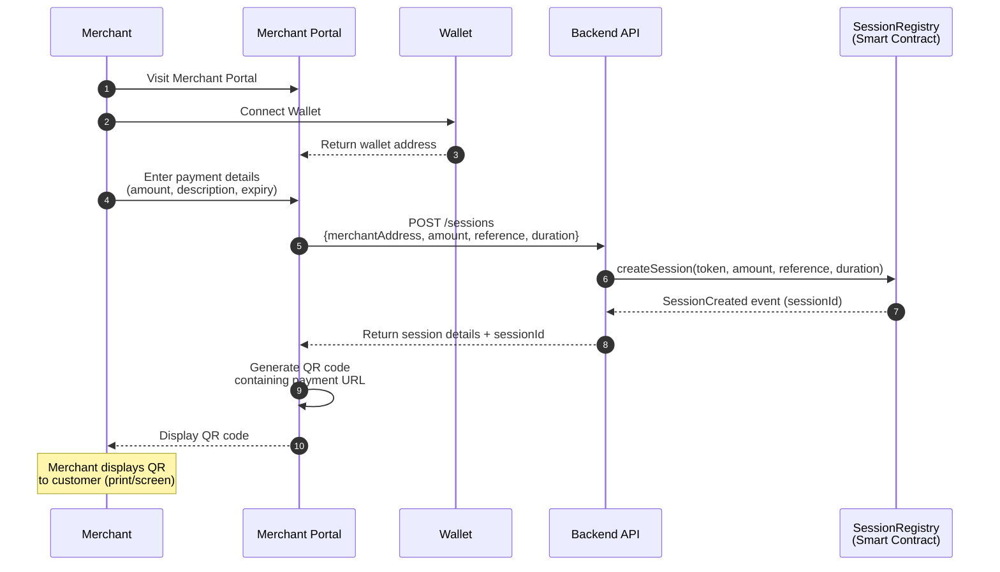
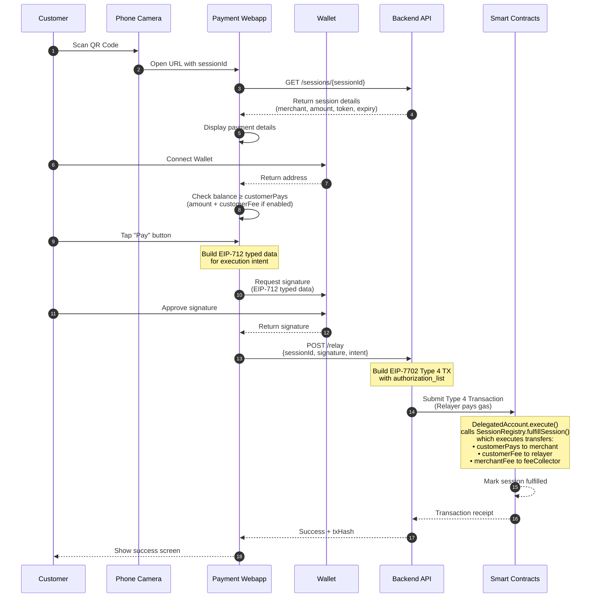
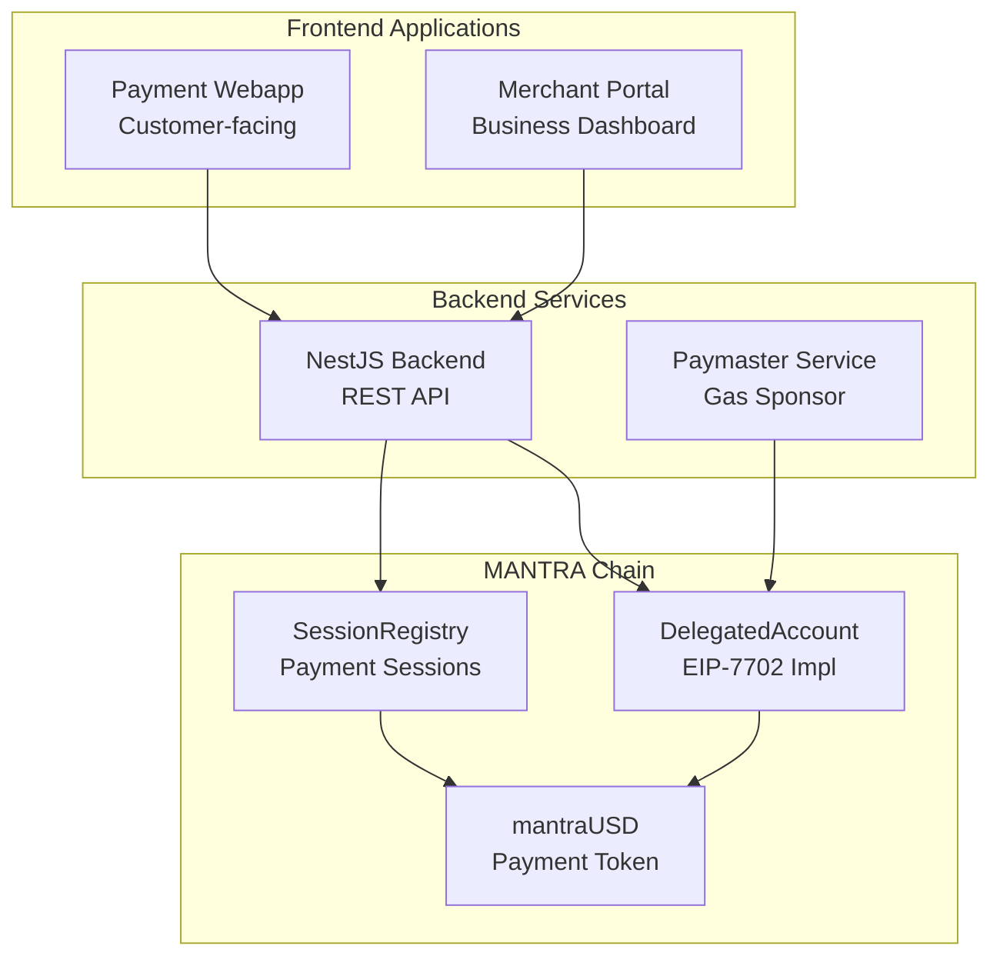
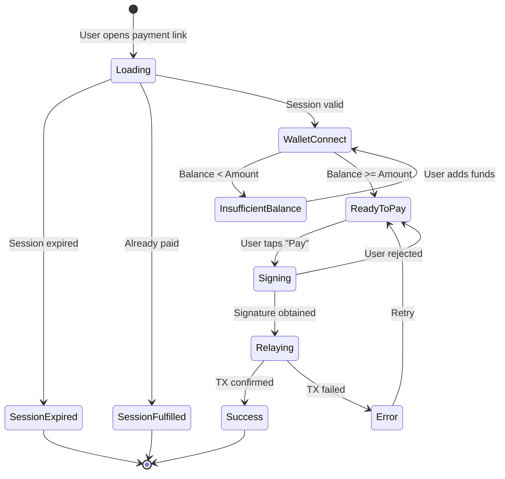

# EIP-7702 Gasless Scan-to-Pay for MANTRA Chain

## Version 2.0

---

## 1. Executive Overview

### 1.1 Project Context

This project builds upon the **OMies dApp SPA Template** - a production-ready React 19 + Foundry monorepo designed for
MANTRA Chain. The existing infrastructure provides:

- **Frontend**: React 19, Vite, TanStack Router, Wagmi + Viem, AppKit (WalletConnect)
- **Contracts**: Foundry-based Solidity development with MANTRA Chain configurations
- **Components**: Pre-built Web3 components (`TransactionDialog`, `WalletConnectPill`, `TokenInput`, etc.)

### 1.2 EIP-7702 Technical Context

EIP-7702 enables **temporary EOA delegation** via Type 4 transactions, allowing:

- EOAs to execute smart contract logic without permanent migration
- Atomic authorization + execution in a single transaction
- Relayer-sponsored gas (gasless UX for users)
- Revocable delegation controlled by the EOA owner

### 1.3 Token Information

**mantraUSD** is the payment token for this Scan-to-Pay system:

| Network                   | Contract Address                             | Symbol    | Decimals |
|---------------------------|----------------------------------------------|-----------|----------|
| **Mainnet (5888)**        | `0xd2b95283011E47257917770D28Bb3EE44c849f6F` | mantraUSD | 6        |
| **Dukong Testnet (5887)** | `0x4B545d0758eda6601B051259bD977125fbdA7ba2` | mmUSD     | 6        |

### 1.4 Fee Model

The platform supports **two independent fee types** that can be enabled/disabled separately:

#### Fee Types

| Fee Type         | Calculation Method  | Description                                                                                 |
|------------------|---------------------|---------------------------------------------------------------------------------------------|
| **Customer Fee** | Dynamic (gas-based) | Calculated at payment time based on current gas price + buffer. Covers relayer's gas costs. |
| **Merchant Fee** | Fixed percentage    | Service fee deducted from merchant's receivable amount (configurable bps).                  |

#### Customer Fee: Dynamic Gas-Based Pricing

The Customer Fee works like Uber's dynamic pricing - calculated in real-time based on current network conditions:



**Calculation Formula:**

```
estimatedGas = 150,000 (typical EIP-7702 tx)
currentGasPrice = eth_gasPrice()
gasCostInOM = estimatedGas × currentGasPrice
gasCostInUSD = gasCostInOM × OM_USD_PRICE
customerFee = gasCostInUSD × (1 + bufferPercent)
```

**Customer Fee Parameters:**

| Parameter            | Value          | Description                                   |
|----------------------|----------------|-----------------------------------------------|
| **Estimated Gas**    | 150,000        | Conservative estimate for EIP-7702 payment tx |
| **Buffer Percent**   | 20%            | Covers gas price volatility                   |
| **Max Customer Fee** | 1.00 mantraUSD | Hard cap to protect users                     |
| **Min Customer Fee** | 0.01 mantraUSD | Minimum charge when enabled                   |
| **Quote TTL**        | 60 seconds     | Fee quote valid for this duration             |

#### Merchant Fee: Fixed Percentage

The Merchant Fee is a traditional percentage-based service fee:

| Parameter             | Value            | Description                |
|-----------------------|------------------|----------------------------|
| **Merchant Fee Rate** | 0-5% (0-500 bps) | Configurable service fee   |
| **Max Fee**           | 5% (500 bps)     | Hard cap in smart contract |
| **Min Fee**           | 0.001 mantraUSD  | Minimum fee amount         |

#### Example Scenarios

**Scenario 1: Both fees enabled (gas price = $0.05)**

```
Payment Amount:       100.00 mantraUSD
├── Customer Fee:      +0.06 mantraUSD (gas $0.05 + 20% buffer)
├── Customer Pays:    100.06 mantraUSD
├── Merchant Fee:      -1.00 mantraUSD (1% service fee)
└── Merchant Receives:  99.00 mantraUSD

Relayer Outcome:
├── Received:          0.06 mantraUSD (customer fee)
├── Actual Gas Cost:   0.04 mantraUSD (gas was cheaper)
└── Profit:            0.02 mantraUSD
```

**Scenario 2: Only Customer Fee enabled (high gas)**

```
Payment Amount:       100.00 mantraUSD
├── Customer Fee:      +0.12 mantraUSD (gas $0.10 + 20% buffer)
├── Customer Pays:    100.12 mantraUSD
└── Merchant Receives: 100.00 mantraUSD
```

**Scenario 3: Only Merchant Fee enabled (free for customers)**

```
Payment Amount:       100.00 mantraUSD
├── Customer Pays:    100.00 mantraUSD
├── Merchant Fee:      -1.00 mantraUSD (1% service fee)
└── Merchant Receives:  99.00 mantraUSD

Note: Relayer absorbs gas cost from merchant fees or treasury
```

**Scenario 4: Both fees disabled (fully subsidized)**

```
Payment Amount:       100.00 mantraUSD
├── Customer Pays:    100.00 mantraUSD
└── Merchant Receives: 100.00 mantraUSD

Note: Relayer absorbs all gas costs (promotional/loss-leader)
```

#### Fee Configuration Summary

| Parameter              | Type    | Description                                          |
|------------------------|---------|------------------------------------------------------|
| **customerFeeEnabled** | bool    | Toggle dynamic gas fee on/off                        |
| **merchantFeeEnabled** | bool    | Toggle service fee on/off                            |
| **merchantFeeBps**     | uint256 | Merchant fee in basis points                         |
| **gasBufferPercent**   | uint256 | Buffer added to gas estimate (default: 20%)          |
| **maxCustomerFee**     | uint256 | Cap on customer fee in token units                   |
| **feeCollector**       | address | Receives merchant fees (customer fees go to relayer) |

**Key Design Decisions:**

- **Dynamic customer fee**: Calculated per-request based on real-time gas price
- **User signs exact amount**: Customer commits to specific fee when signing
- **Relayer profit/loss**: Relayer keeps difference between quoted and actual gas
- **Quote expiration**: Fee quotes expire quickly (60s) to limit gas price risk
- **Independent switches**: Each fee can be enabled/disabled separately
- **Merchant fee is percentage**: Service fee remains simple percentage-based
- **Transparent UI**: Customer sees exact fee before signing

---

## 2. User Flow

### 2.1 Merchant Flow (QR Code Generation)



**Flow Summary:**

1. Merchant visits Merchant Portal (web app)
2. Connects wallet (identifies as merchant)
3. Creates payment request (amount, description, expiration)
4. System generates QR code containing payment URL
5. Merchant displays QR code to customer

### 2.2 Customer Payment Flow



**Flow Summary:**

1. Customer scans QR code with phone camera
2. Opens payment webapp showing amount and merchant
3. Connects wallet (mobile wallet or browser extension)
4. Reviews payment details and taps "Pay"
5. Signs EIP-712 typed data (no gas required from user)
6. Backend relays transaction (pays gas on behalf of user)
7. Smart contract executes payment and marks session complete
8. Customer sees success confirmation

---

## 3. System Architecture

### 3.1 High-Level Architecture



### 3.2 Repository Structure

```
packages/
├── config/              # Shared configuration package
│   └── src/
│       ├── chains.ts    # Chain definitions
│       ├── contracts.ts # Contract addresses
│       ├── tokens.ts    # Token configurations
│       ├── fees.ts      # Fee configuration
│       └── abis/        # Contract ABIs
├── contracts/           # Foundry smart contracts
│   └── src/
│       ├── DelegatedAccount.sol
│       └── SessionRegistry.sol
├── webapp/              # Customer payment PWA
│   └── src/
│       ├── routes/
│       │   └── pay/$sessionId.tsx
│       └── hooks/
│           ├── usePaymentSession.ts
│           ├── useEIP712Sign.ts
│           └── useRelayPayment.ts
├── merchant-portal/     # Merchant dashboard
│   └── src/
│       ├── routes/
│       └── hooks/
├── backend/             # NestJS API + Relayer
│   └── src/
│       └── modules/
│           ├── session/
│           ├── relay/
│           └── blockchain/
├── docs/
│   └── scan-to-pay/
│       ├── API.md                           # Backend API documentation
│       ├── MERCHANT_GUIDE.md                # Merchant portal guide
│       └── INTEGRATION.md                   # Integration guide
│
└── docker-compose.yml                       # Local development setup            
```

---

## 4. Shared Configuration Package

The `@mantrausd-pay/config` package provides type-safe, centralized configuration for all applications.

### 4.1 Configuration Types

```typescript
// Chain Configuration
interface ChainConfig {
  id: number;
  name: string;
  network: string;
  nativeCurrency: { name: string; symbol: string; decimals: number };
  rpcUrls: { default: { http: string[] } };
  blockExplorers: { default: { name: string; url: string } };
}

// Contract Addresses per Chain
interface ContractAddresses {
  delegatedAccount: Address;
  sessionRegistry: Address;
  mantraUSD: Address;
}

// Token Configuration
interface TokenConfig {
  address: Address;
  symbol: string;
  name: string;
  decimals: number;
}

// Fee Configuration
interface FeeConfig {
  // Customer fee (dynamic, gas-based)
  customerFeeEnabled: boolean;    // Toggle for customer fee
  gasBufferPercent: number;       // Buffer added to gas estimate (e.g., 20)
  maxCustomerFee: bigint;         // Max customer fee in token units
  minCustomerFee: bigint;         // Min customer fee in token units
  quoteTTL: number;               // Fee quote validity in seconds
  // Merchant fee (fixed percentage)
  merchantFeeEnabled: boolean;    // Toggle for merchant fee
  merchantFeeBps: number;         // Merchant fee in basis points (100 = 1%)
  maxMerchantFeeBps: number;      // Maximum allowed merchant fee
  // Common
  feeCollector: Address;          // Treasury for merchant fees
}
```

### 4.2 Exported Functions

| Function                                | Description                                        |
|-----------------------------------------|----------------------------------------------------|
| `getChainConfig(chainId)`               | Returns chain configuration for given ID           |
| `getContractAddress(chainId, contract)` | Returns contract address for chain                 |
| `getTokenConfig(chainId)`               | Returns mantraUSD config for chain                 |
| `getFeeConfig(chainId)`                 | Returns fee configuration for chain                |
| `estimateCustomerFee(chainId)`          | Calculates current customer fee based on gas price |
| `calculateMerchantFee(chainId, amount)` | Computes merchant fee for given amount             |
| `isChainSupported(chainId)`             | Check if chain ID is supported                     |

### 4.3 Supported Networks

| Network        | Chain ID | Environment |
|----------------|----------|-------------|
| MANTRA Mainnet | 5888     | Production  |
| MANTRA Dukong  | 5887     | Testnet     |

---

## 5. Smart Contract Specifications

### 5.1 DelegatedAccount.sol

The core EIP-7702 implementation contract that user EOAs will temporarily delegate to.

#### Design Principles

- **Stateless**: All state lives on the delegating EOA, not this contract
- **Atomic**: Authorization and execution happen in one transaction
- **Secure**: Multiple validation layers (nonce, signature, expiry)

#### Interface

```solidity
interface IDelegatedAccount {
    // Events
    event ExecutionSuccess(address indexed account, address indexed destination, uint256 value, bytes data);
    event ExecutionFailed(address indexed account, address indexed destination, uint256 value, bytes data, bytes reason);

    // Errors
    error InvalidSignature();
    error ExpiredSignature();
    error InvalidNonce();
    error ExecutionReverted(bytes reason);
    error InvalidDestination();

    // EIP-712 Constants
    function NAME() external view returns (string memory);           // "DelegatedAccount"
    function VERSION() external view returns (string memory);        // "1"
    function EXECUTE_TYPEHASH() external view returns (bytes32);

    function DOMAIN_SEPARATOR() external view returns (bytes32);

    // Core Functions
    function execute(
        address destination,
        uint256 value,
        bytes calldata data,
        uint256 deadline,
        bytes calldata signature
    ) external returns (bytes memory);

    function transferToken(
        address token,
        address to,
        uint256 amount,
        uint256 deadline,
        bytes calldata signature
    ) external returns (bool);

    // EIP-1271 Support
    function isValidSignature(bytes32 hash, bytes calldata signature) external view returns (bytes4);

    // View Functions
    function getNonce(address account) external view returns (uint256);

    function getExecuteDigest(
        address account,
        address destination,
        uint256 value,
        bytes calldata data,
        uint256 nonce,
        uint256 deadline
    ) external view returns (bytes32);
}
```

#### EIP-712 Typed Data Structure

```typescript
const EXECUTE_TYPES = {
  Execute: [
    {name: 'account', type: 'address'},
    {name: 'destination', type: 'address'},
    {name: 'value', type: 'uint256'},
    {name: 'data', type: 'bytes'},
    {name: 'nonce', type: 'uint256'},
    {name: 'deadline', type: 'uint256'},
  ],
};
```

### 5.2 SessionRegistry.sol

On-chain session management for payment requests with dual fee support.

**Note:** Customer fee is calculated off-chain by the backend based on current gas prices. The smart contract only
validates and records the fee amounts provided during session fulfillment.

#### Interface

```solidity
interface ISessionRegistry {
    // Structs
    struct FeeConfig {
        // Merchant fee (percentage-based)
        uint256 merchantFeeBps;      // Merchant fee in basis points
        bool merchantFeeEnabled;     // Toggle for merchant fee
        uint256 maxMerchantFeeBps;   // Max merchant fee (500 = 5%)
        // Customer fee (validated but calculated off-chain)
        bool customerFeeEnabled;     // Toggle for customer fee
        uint256 maxCustomerFee;      // Max customer fee in token units
        uint256 minCustomerFee;      // Min customer fee in token units
        // Common
        address feeCollector;        // Address receiving merchant fees
    }

    struct PaymentSession {
        bytes32 id;                  // Unique session identifier
        address merchant;            // Recipient of funds
        address token;               // ERC-20 token address
        uint256 amount;              // Base payment amount (what merchant requested)
        uint256 customerFee;         // Fee charged to customer (added to amount)
        uint256 merchantFee;         // Fee deducted from merchant receivable
        uint256 customerPays;        // Total customer pays (amount + customerFee)
        uint256 merchantReceives;    // Net merchant receives (amount - merchantFee)
        string reference;            // Optional merchant reference
        uint256 createdAt;           // Session creation timestamp
        uint256 expiresAt;           // Session expiration timestamp
        bool fulfilled;              // Whether payment has been made
        address payer;               // Address that fulfilled
        bytes32 txHash;              // Transaction hash of fulfillment
    }

    // Events
    event SessionCreated(
        bytes32 indexed sessionId,
        address indexed merchant,
        address token,
        uint256 amount,
        uint256 customerFee,
        uint256 merchantFee,
        uint256 customerPays,
        uint256 merchantReceives,
        string reference,
        uint256 expiresAt
    );

    event SessionFulfilled(
        bytes32 indexed sessionId,
        address indexed payer,
        address indexed merchant,
        uint256 amount,
        uint256 customerFee,
        uint256 merchantFee,
        uint256 totalFees,
        uint256 timestamp
    );

    event SessionCancelled(bytes32 indexed sessionId);

    event FeeConfigUpdated(
        uint256 merchantFeeBps,
        uint256 maxCustomerFee,
        bool customerFeeEnabled,
        bool merchantFeeEnabled,
        address feeCollector
    );

    event CustomerFeeToggled(bool enabled);
    event MerchantFeeToggled(bool enabled);
    event FeesWithdrawn(address indexed token, address indexed to, uint256 amount);

    // Errors
    error SessionNotFound();
    error SessionExpired();
    error SessionAlreadyFulfilled();
    error UnauthorizedMerchant();
    error InvalidAmount();
    error InvalidExpiry();
    error InvalidToken();
    error FeeTooHigh();
    error InvalidFeeCollector();
    error NoFeesToWithdraw();

    // Constants
    function MIN_SESSION_DURATION() external view returns (uint256); // 5 minutes
    function MAX_SESSION_DURATION() external view returns (uint256); // 24 hours
    function MAX_FEE_BPS() external view returns (uint256);          // 500 (5% per fee type)
    function BPS_DENOMINATOR() external view returns (uint256);      // 10000

    // Admin Functions - Fee Configuration
    function setAllowedToken(address token, bool allowed) external;

    function setFeeConfig(
        uint256 merchantFeeBps,
        uint256 maxCustomerFee,
        address feeCollector
    ) external;

    function setCustomerFeeEnabled(bool enabled) external;

    function setMerchantFeeEnabled(bool enabled) external;

    function withdrawFees(address token) external;

    // Session Management
    function createSession(
        address token,
        uint256 amount,
        uint256 customerFee,
        uint256 customerPays,
        uint256 merchantReceives,
        string calldata reference,
        uint256 duration
    ) external returns (bytes32 sessionId);

    function fulfillSession(bytes32 sessionId, address payer) external;

    function cancelSession(bytes32 sessionId) external;

    // View Functions
    function getFeeConfig() external view returns (FeeConfig memory);

    /// @notice Calculate merchant fee only (customer fee calculated off-chain)
    function calculateMerchantFee(uint256 amount) external view returns (
        uint256 merchantFee,
        uint256 merchantReceives
    );

    /// @notice Validate customer fee is within bounds
    function validateCustomerFee(uint256 customerFee) external view returns (bool valid);

    function getSession(bytes32 sessionId) external view returns (PaymentSession memory);

    function getMerchantSessions(address merchant) external view returns (bytes32[] memory);

    function isSessionValid(bytes32 sessionId) external view returns (bool);

    function isTokenAllowed(address token) external view returns (bool);

    function getAccumulatedFees(address token) external view returns (uint256);
}
```

---

## 6. Backend API Specifications

### 6.1 Overview

The NestJS backend serves as the relayer and session management layer.

**Responsibilities:**

- Session creation and retrieval
- Transaction relay (gasless payments)
- Paymaster gas management
- Rate limiting and security

### 6.2 Session API

#### Create Session

```
POST /sessions
```

**Request Body:**

| Field             | Type   | Required | Description                                |
|-------------------|--------|----------|--------------------------------------------|
| `merchantAddress` | string | Yes      | Merchant wallet address                    |
| `amount`          | string | Yes      | Payment amount (e.g., "50.00")             |
| `reference`       | string | No       | Optional order reference                   |
| `duration`        | number | No       | Session duration in seconds (default: 900) |
| `chainId`         | number | Yes      | Chain ID (5887 or 5888)                    |

**Response:**

```typescript
interface SessionResponse {
  sessionId: string;
  merchantAddress: string;
  tokenAddress: string;
  // Base amount
  amount: string;                 // Base payment amount merchant requested
  amountFormatted: string;
  // Customer fee (dynamic, gas-based)
  customerFee: string;            // Network fee (calculated from current gas price)
  customerFeeUSD: string;         // Fee in USD for display
  customerFeeEnabled: boolean;
  gasPrice: string;               // Current gas price used for calculation
  gasPriceGwei: string;           // Gas price in Gwei for transparency
  feeQuoteExpiresAt: number;      // Timestamp when this fee quote expires
  // Merchant fee (percentage-based)
  merchantFee: string;            // Service fee deducted from merchant
  merchantFeePercent: string;     // e.g., "1.00"
  merchantFeeEnabled: boolean;
  // Computed totals
  customerPays: string;           // amount + customerFee
  merchantReceives: string;       // amount - merchantFee
  totalFees: string;              // customerFee + merchantFee
  feeCollector: string;           // For merchant fees
  // Session details
  reference: string;
  createdAt: number;
  expiresAt: number;
  fulfilled: boolean;
  payer?: string;
  qrUrl: string;
  paymentUrl: string;
  chainId: number;
  networkName: string;
  tokenSymbol: string;
}
```

**Fee Quote Refresh:**

Since customer fee is dynamic, the frontend should:

1. Check `feeQuoteExpiresAt` before payment
2. Re-fetch session if quote expired
3. Show user the updated fee before signing

#### Get Session

```
GET /sessions/{sessionId}?chainId={chainId}
```

#### Check Session Validity

```
GET /sessions/{sessionId}/valid?chainId={chainId}
```

**Response:**

```typescript
{
  valid: boolean
}
```

#### Get Merchant Sessions

```
GET /sessions/merchant/{address}?chainId={chainId}&limit={limit}&offset={offset}
```

### 6.3 Gas Fee Quote API

Since customer fees are dynamic, the backend provides real-time gas fee quotes.

#### Get Current Gas Fee Quote

```
GET /fees/quote?chainId={chainId}
```

**Response:**

```typescript
interface GasFeeQuote {
  customerFee: string;        // Fee in mantraUSD (e.g., "0.06")
  customerFeeUSD: string;     // Fee in USD for display
  gasPrice: string;           // Current gas price in wei
  gasPriceGwei: string;       // Gas price in Gwei
  estimatedGas: number;       // Gas units estimated (150000)
  bufferPercent: number;      // Buffer applied (20)
  expiresAt: number;          // Quote expiration timestamp
  quoteTTL: number;           // TTL in seconds (60)
  enabled: boolean;           // Whether customer fee is enabled
}
```

**Notes:**

- Quote is valid for `quoteTTL` seconds (default: 60)
- Frontend should re-fetch if quote expires before user signs
- If `enabled: false`, customer fee is 0 (relayer subsidized)

### 6.4 Relay API

#### Relay Transaction

```
POST /relay
```

**Request Body:**

```typescript
interface RelayRequest {
  sessionId: string;
  userAddress: string;
  signature: string;       // EIP-712 signature
  intent: {
    destination: string;   // Token contract address
    value: string;         // Native value (usually "0")
    data: string;          // Encoded transfer call
    nonce: string;         // User nonce
    deadline: string;      // Signature expiration
  };
  chainId: number;
}
```

**Response:**

```typescript
interface RelayResult {
  success: boolean;
  txHash: string;
  explorerUrl: string;
  message: string;
}
```

#### Get Relayer Status

```
GET /relay/status?chainId={chainId}
```

**Response:**

```typescript
interface RelayStatus {
  available: boolean;
  balance: string;      // Paymaster balance
  address: string;      // Paymaster address
}
```

### 6.5 Security & Validation

| Validation                 | Description                                         |
|----------------------------|-----------------------------------------------------|
| **Session State**          | Verify session is valid, not expired, not fulfilled |
| **Signature Verification** | Recover signer matches userAddress                  |
| **Nonce Check**            | Verify nonce matches on-chain nonce                 |
| **Simulation**             | Simulate transaction before broadcast               |
| **Rate Limiting**          | 10 requests per minute per IP                       |
| **Gas Price Cap**          | Reject if gas price exceeds threshold               |
| **Fee Quote Validation**   | Ensure customer fee quote hasn't expired            |
| **Customer Fee Cap**       | Reject if customer fee exceeds maxCustomerFee       |

---

## 7. Frontend Specifications

### 7.1 Customer Payment Webapp

#### Route Structure

```
/pay/{sessionId}?chainId={chainId}
```

#### Required Hooks

| Hook                                    | Description                            |
|-----------------------------------------|----------------------------------------|
| `usePaymentSession(sessionId, chainId)` | Fetch session details, poll for status |
| `useEIP712Sign(chainId)`                | Build typed data, request signature    |
| `useRelayPayment()`                     | Submit signed intent to relay          |

#### UI States



#### Component Requirements

| Component                | Purpose                                                  |
|--------------------------|----------------------------------------------------------|
| `PaymentLoading`         | Skeleton UI while fetching session                       |
| `SessionExpired`         | Error state for expired sessions                         |
| `PaymentAlreadyComplete` | Success state for fulfilled sessions                     |
| `ConnectWalletPrompt`    | Prompt to connect wallet                                 |
| `InsufficientBalance`    | Warning when balance is too low                          |
| `PaymentConfirm`         | Main payment screen with amount, merchant, fee breakdown |
| `SigningPrompt`          | Modal during signature request                           |
| `ProcessingPayment`      | Loading state during relay                               |
| `PaymentSuccess`         | Success with tx hash link                                |
| `PaymentError`           | Error with retry option                                  |

#### PaymentConfirm Display Requirements

- Display total amount customer will pay
- Show merchant name/address
- Display fee breakdown (transparency)
- Show network fee line:
  - If `customerFeeEnabled` is **true**: show `Network Fee: $X.XX` where `$X.XX` equals the computed `customerFee`.
  - If `customerFeeEnabled` is **false**: show `Network Fee: $0.00 (Gasless!)`.
- Show "You Pay" total
- Optionally show "Merchant receives" amount
- Expiry countdown timer
- Pay button (disabled if insufficient balance)

### 7.2 Merchant Portal

#### Route Structure

```
/                    # Dashboard
/create              # Create payment request
/sessions/{id}       # Session detail with QR code
/history             # Payment history
```

#### Required Hooks

| Hook                                    | Description                |
|-----------------------------------------|----------------------------|
| `useCreateSession(chainId)`             | Create new payment session |
| `useMerchantSessions(chainId, options)` | List merchant's sessions   |

#### Session List Item Display

For each session, display:

- Reference or session ID
- Amount customer paid
- Amount merchant received (after fee)
- Status badge (Active, Fulfilled, Expired, Cancelled)
- Date created
- Payer address (if fulfilled)

#### Dashboard Requirements

- Stats cards: Today's payments count, Today's volume, Active requests count
- Active sessions list with QR code action
- Recent payments list
- Quick "New Payment" button

---

## 8. Security Considerations

### 8.1 Smart Contract Security

| Control                    | Description                                             |
|----------------------------|---------------------------------------------------------|
| **Nonce Management**       | Strict nonce tracking prevents replay attacks           |
| **Deadline Enforcement**   | All signatures have expiration timestamps               |
| **Destination Validation** | Cannot call self or zero address                        |
| **Signature Verification** | EIP-712 structured data prevents signature malleability |
| **Access Control**         | Only the EOA owner can authorize executions             |
| **Fee Caps**               | Maximum 5% fee enforced in contract                     |

### 8.2 Relayer Security

| Control                         | Description                               |
|---------------------------------|-------------------------------------------|
| **Simulation Before Broadcast** | All transactions simulated via `eth_call` |
| **Session Validation**          | On-chain verification of session state    |
| **Rate Limiting**               | Prevent DoS attacks on relayer            |
| **Gas Budget Tracking**         | Monitor and limit paymaster spending      |
| **Idempotency**                 | Sessions can only be fulfilled once       |

### 8.3 Frontend Security

| Control                     | Description                                           |
|-----------------------------|-------------------------------------------------------|
| **Domain Binding**          | EIP-712 domain includes contract address and chain ID |
| **User Confirmation**       | Clear UI showing what the user is signing             |
| **No Private Key Handling** | All signing via wallet connection                     |
| **Session Timeout**         | Frontend enforces session expiry                      |

---

## 9. Future Enhancements

### 9.1 The Graph Subgraph Integration

While the MVP relies on the backend API for data access, a subgraph becomes valuable as the system scales.

#### When to Implement

| Indicator                | Threshold  |
|--------------------------|------------|
| Daily transactions       | > 1,000    |
| Concurrent merchants     | > 100      |
| Historical data requests | Frequent   |
| Real-time requirements   | Sub-second |

#### Subgraph Entities

| Entity       | Description                                      |
|--------------|--------------------------------------------------|
| `Session`    | Payment session with status, amounts, timestamps |
| `Merchant`   | Merchant stats (total sessions, volume, etc.)    |
| `Token`      | Token stats (total volume, session count)        |
| `DailyStats` | Daily aggregated metrics                         |
| `Execution`  | DelegatedAccount execution records               |

### 9.2 Additional Enhancements

| Enhancement                      | Priority |
|----------------------------------|----------|
| Multi-token Support (USDC, USDT) | Medium   |
| Merchant Categories              | Low      |
| Recurring Payments               | Medium   |
| Refund Mechanism                 | High     |
| Webhook Notifications            | Medium   |
| Mobile SDK                       | Low      |
| Batch Payments                   | Low      |

---

This PRD provides a complete specification for the EIP-7702 Gasless Scan-to-Pay feature, tailored for the OMies dApp
template and MANTRA Chain ecosystem using mantraUSD as the payment token.
